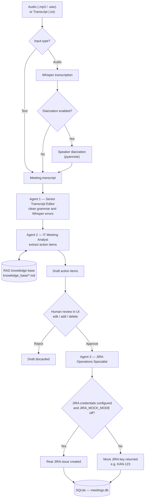
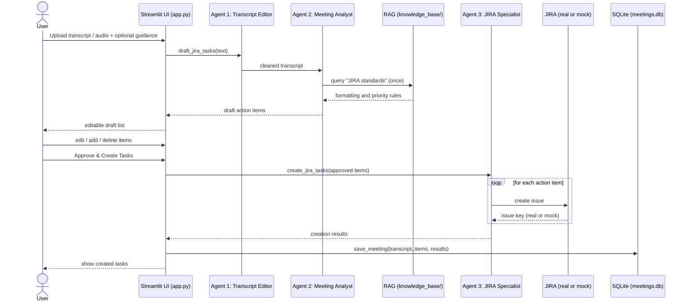
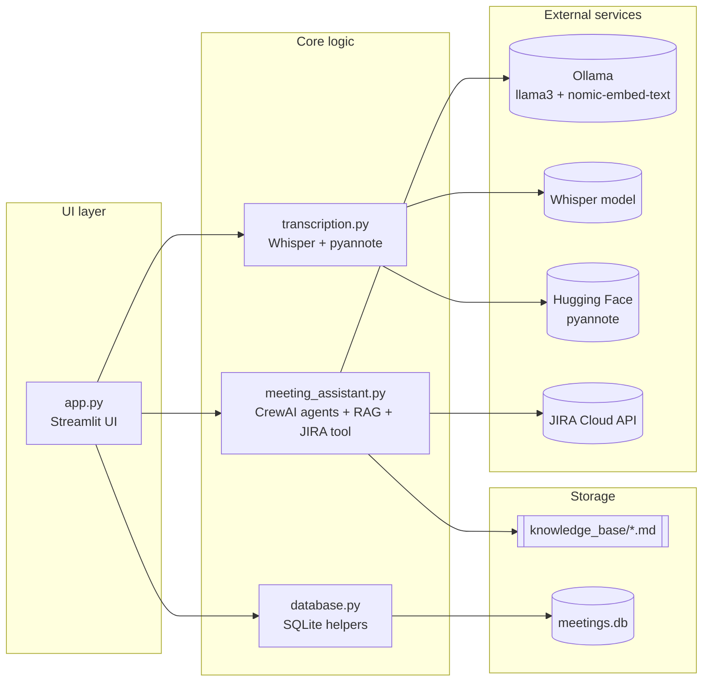

# Autonomous JIRA & Meeting Analysis Assistant

[](https://github.com/goksungurel/Autonomous-JIRA-Meeting-Analysis-Assistant/actions/workflows/tests.yml)

[](LICENSE)

A privacy-first, local AI assistant that turns a raw meeting recording (or transcript) into approved JIRA tasks — with a human in the loop before anything gets written.

- Transcribes meeting audio with **Whisper**.
- Optionally adds speaker diarization with **pyannote**.
- Cleans the transcript and extracts action items with a **3-agent CrewAI pipeline** running on a **local Ollama LLM**.
- Aligns action items with your team's own conventions via local **RAG** rules in `knowledge_base/`.
- Requires **explicit human approval** in the UI before creating anything in JIRA.
- Creates one JIRA task per approved action item — in **mock mode** by default, or against a **real JIRA** instance once credentials are configured.

A Streamlit UI ties the whole workflow together so it can be run entirely from a browser.

## Core value proposition

- **Privacy-first execution:** the LLM and embeddings run locally via Ollama (`llama3`, `nomic-embed-text`) — meeting content never leaves your machine unless you enable real JIRA creation.
- **Tiered agentic workflow:** a 3-agent CrewAI pipeline transforms raw meeting content into structured, standards-compliant task output.
- **Local RAG standards:** action items are formatted according to internal rules stored in `knowledge_base/`, not hardcoded prompts.
- **Human-in-the-loop approval:** drafts can be edited, added to, or deleted in the UI, and nothing is sent to JIRA until you click approve.

## Architecture



### Multi-agent pipeline (CrewAI)

| Agent | Role | Responsibility |
|---|---|---|
| 1 | Senior Transcript Editor | Fixes grammar, Whisper misinterpretations, and produces a structured English meeting record. |
| 2 | IT Meeting Analyst | Queries the local knowledge base **exactly once** for `"JIRA standards"`, then extracts action items in the required format. |
| 3 | JIRA Operations Specialist | Creates one JIRA task per approved action item via `JiraTaskTool`. |

### Human-in-the-loop flow



### Module map



## Tech stack

- **UI:** Streamlit (`app.py`)
- **Agent orchestration:** CrewAI (`meeting_assistant.py`)
- **Local LLM + embeddings:** Ollama (`llama3`, `nomic-embed-text`)
- **Speech-to-text:** OpenAI Whisper (`transcription.py`)
- **Speaker diarization (optional):** `pyannote.audio` (requires a Hugging Face token)
- **RAG rules / standards:** Markdown files in `knowledge_base/`
- **Session history:** SQLite (`database.py`) — meetings and JIRA outputs persisted locally, with search/filter by file name and date
- **CI:** GitHub Actions runs the test suite on every push/PR (`.github/workflows/tests.yml`)

## Repository structure

- `app.py` — Streamlit UI: upload, transcription, draft task generation, and approval-based JIRA creation.
- `meeting_assistant.py` — 3-agent CrewAI logic, RAG integration, and the JIRA tool (mock/real switch).
- `transcription.py` — Whisper transcription functions (+ optional diarization).
- `database.py` — SQLite helpers for persisting meeting history.
- `knowledge_base/meeting_rules_and_samples.md` — sample standards and "JIRA rules" used by RAG.
- `requirements.txt` — Python dependencies.
- `tests/` — unit tests for pure utility functions and database operations (run with `pytest`).
- `.github/workflows/tests.yml` — CI pipeline that runs the test suite.

## Prerequisites

### System requirements

- macOS / Linux recommended
- Python 3.10+
- `ffmpeg` installed (needed by Whisper for many audio formats)

### Ollama setup (local LLM + embeddings)

1. Install Ollama using the official instructions.
2. Start the Ollama server (default: `http://localhost:11434`).
3. Pull the required models:

```bash
ollama pull llama3:latest
ollama pull nomic-embed-text
```

> Note: Ollama is only needed when actually running the agents (drafting/analyzing a meeting). The test suite does **not** require it — see [Running tests](#running-tests).

## Installation

```bash
python -m venv venv
source venv/bin/activate
pip install -r requirements.txt
```

For optional diarization support, uncomment `pyannote.audio` in `requirements.txt` before installing.

## Environment variables

Create a `.env` file in the project root:

```bash
# Optional (for diarization)
HF_TOKEN="your_huggingface_token"

# Optional (for real JIRA API calls — all four must be set to leave mock mode)
JIRA_URL="https://your-domain.atlassian.net"
JIRA_EMAIL="you@company.com"
JIRA_TOKEN="your_jira_api_token"
JIRA_PROJECT_KEY="KAN"

# Optional: force mock JIRA responses even if the credentials above are set
JIRA_MOCK_MODE=false

# Optional: require this password before the Streamlit UI is shown.
# The app has no built-in auth beyond this — without it, only run on localhost.
APP_PASSWORD=""
```

## Run the app

```bash
streamlit run app.py
```

Then:

1. Upload a `.txt` transcript or `.mp3`/`.wav` audio file.
2. If audio, select the **audio language** (English by default) and optionally enable diarization, then click **Transcribe Audio (Whisper)**.
3. Add optional **Human Input** guidance.
4. Click **Generate Task Suggestions**.
5. Review and edit the draft tasks.
6. Click **Approve & Create Tasks on JIRA** to proceed, or reject the draft.
7. Approved meetings are saved automatically — view, search, and filter past meetings in the **Meeting History** sidebar.

## Speaker diarization (optional)

If enabled, `transcription.py` uses `pyannote/speaker-diarization-3.1` and requires:

- `HF_TOKEN` with model access,
- installation of `pyannote.audio` (not in `requirements.txt` by default).

## JIRA integration status

`JiraTaskTool` automatically switches between mock and real mode based on your environment — no source edits required:

- **Mock mode (default):** if any of `JIRA_URL`, `JIRA_EMAIL`, `JIRA_TOKEN`, `JIRA_PROJECT_KEY` is missing (or `JIRA_MOCK_MODE=true`), the tool returns a simulated key (e.g., `KAN-123`) without making any real API calls. This lets the app run without credentials.
- **Real mode:** once all four variables above are set and `JIRA_MOCK_MODE` is not `true`, the tool creates real JIRA issues.

```bash
# Force mock mode even with valid credentials present (e.g. while testing locally)
JIRA_MOCK_MODE=true
```

## Running tests

```bash
pytest tests/
```

Tests cover pure utility functions (`_parse_action_items`, `_action_items_to_markdown`, `JiraTaskTool` mock behavior) and all database operations. All tests run without Ollama running and without JIRA credentials — the JIRA tool tests force mock mode regardless of what's in your local `.env`, and the RAG knowledge base is only loaded lazily on first real agent run, not at import time.

## Customizing RAG rules

The analyst agent is instructed to query RAG exactly once with `"JIRA standards"`.
Update standards in:

- `knowledge_base/meeting_rules_and_samples.md`

Typical customizations:

- team prefixes (`[Backend]`, `[Frontend]`, `[Mobile]`, etc.),
- priority rules,
- tag conventions,
- output examples/templates.

## Troubleshooting

### "Whisper is not installed"

```bash
pip install openai-whisper
```

### Ollama connection errors

- Ensure Ollama is running.
- Ensure the base URL is `http://localhost:11434`.
- Ensure `llama3:latest` and `nomic-embed-text` are pulled.

### Diarization errors

- Ensure `HF_TOKEN` is set.
- Ensure `pyannote.audio` is installed and model access is granted on Hugging Face.

## Privacy and data handling

- LLM reasoning and embeddings run locally via Ollama.
- Audio/transcripts are processed on your machine.
- If real JIRA integration is enabled, approved tasks are sent to your JIRA instance.
- The Streamlit app has no built-in authentication unless `APP_PASSWORD` is set — treat it as localhost-only otherwise.

---

## License

MIT — see [LICENSE](LICENSE).
